# Hi, I'm Lucas Rueda 👋

**Full Stack Developer | University Programming Analyst**

I'm a developer focused on backend and full stack development, currently finishing my Bachelor's Degree in Information Systems at the National University of Luján (Argentina).

I have experience building SaaS applications, developing backend APIs, integrating payment systems, and automating business processes.

---

# About Me

- Full Stack Developer
- University Programming Analyst (Intermediate Degree – 2026)
- Final stage of the Bachelor's Degree in Information Systems
- Experience building SaaS business applications
- Backend development with Node.js and Express
- Payment integrations (Mercado Pago and Stripe)
- Interested in backend architecture and cloud technologies

---

# Tech Stack

### Languages
Java • Python • JavaScript • PHP

### Backend
Node.js • Express

### Databases
SQL • NoSQL • Firebase

### Cloud & DevOps
Docker • Google Cloud Platform

### Systems & Tools
Linux • Git

---

# Professional Experience

### Full Stack Developer — Nuxon

Development of SaaS applications for business management and point-of-sale systems.

Main contributions:

- Development of SaaS solutions used for business operations
- Integration of online payment systems using Mercado Pago
- Implementation of geolocation features
- Development of push notifications and QR code generation
- Automation of operational processes within the system

---

### Backend Developer Trainee — Atenea Software

- Backend API development using Node.js and Express
- Implementation of authentication using Firebase Authentication
- Integration of payment systems (Stripe and Mercado Pago)

---

### Research Internship — National University of Luján

- Analysis and implementation of search engine algorithms
- Evaluation of algorithm performance using statistical metrics

---

### Data Extraction & AI Transcription Internship — National University of Luján

- Data extraction and processing using web scraping techniques
- Development of AI-based transcription tools for research interviews

---

## GitHub Activity

---

# Contact

LinkedIn  
https://linkedin.com/in/lucas-laureano-rueda

Email  
luquirueda01@gmail.com
